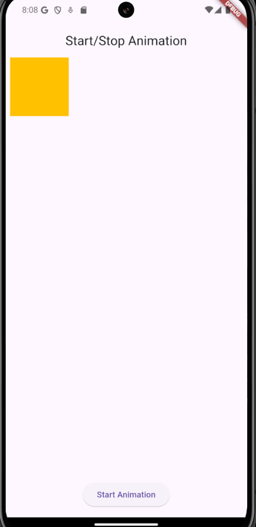
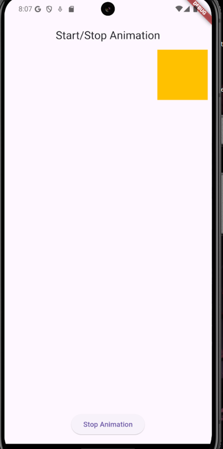

# Flutter Explicit Animation Example

As stated in the `Task 2` of `Lab 5`, This Flutter project demonstrates how to create an explicit animation using an `AnimationController` and a `Tween`. The project features a simple animation where a box moves across the screen, and the user can start and stop the animation with a button.

## Features

- **Explicit Animation**: Uses `AnimationController` and `Tween` to animate a box moving horizontally across the screen.
- **Start/Stop Functionality**: The animation can be started and stopped by a button click.
- **Responsive to Screen Width**: The animation adapts to the device's screen width using `MediaQuery`.

## Screenshots

Here is a screenshot of the application:




## Installation

To get started with this project, follow these steps:

1. **Clone the repository**:
   ```bash
   git clone https://github.com/jtareen/lab5_task2.git
   ```

2. **Navigate to the project directory**:
   ```bash
   cd repo-name
   ```

3. **Install the dependencies**:
   ```bash
   flutter pub get
   ```

4. **Run the app**:
   ```bash
   flutter run
   ```

## Usage

- Tap the **Start Animation** button to move the box horizontally.
- Tap the **Stop Animation** button to pause the animation at any point.
- The box will automatically reverse direction when it reaches the end of the screen.

## License

This project is licensed under the MIT License - see the [LICENSE](LICENSE) file for details.

## Acknowledgments

- Thanks to the Flutter community for the excellent documentation and resources.